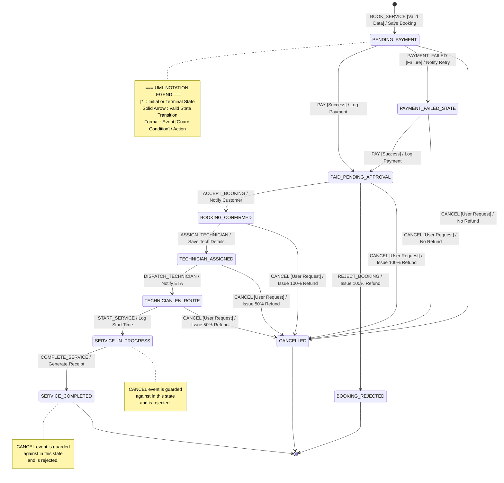

# Lab Assignment 8 - UML State Diagram

Below is the UML State Machine diagram for the appliance repair booking system. It follows standard UML notation where transitions are labeled as `Event [Guard] / Action`.

